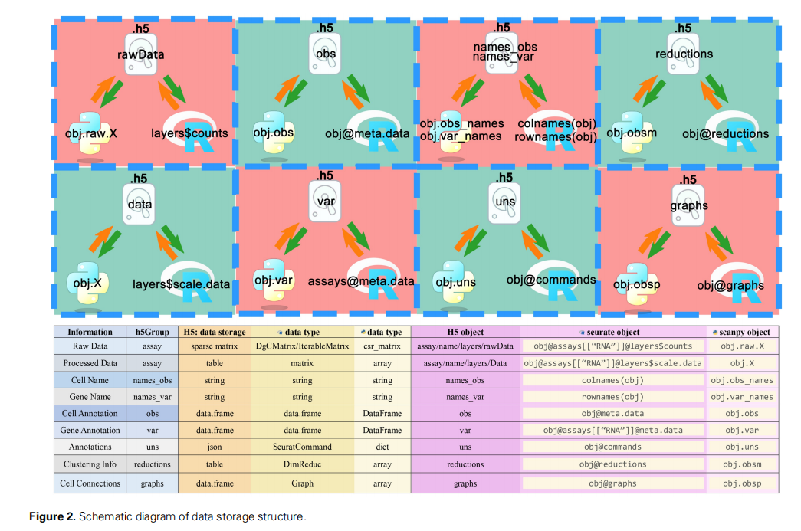
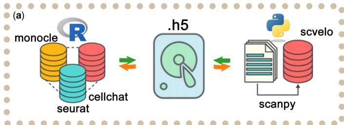

# 探索单细胞数据格式以及格式转换

**写在前面**
**近期的工作**：拿到做了harmony整合的rds格式数据，我现在需要做memento的差异表达分析。我先使用sceasy转为h5ad文件，然后默认adata.X是原始数据做memento，因为做memento要求adata.X是csr_matrix，所以另外做了一个`adata.X = csr_matrix(adata.X)`的转换。现在的问题就是对于不同处理的差异基因分析结果不显著，对各个细胞群分出来的显著基因基本没有，所以我们怀疑前面的分析有问题。**思考到的问题**：1.sceasy在转换数据的时候是否将Array[RNA]的layer[counts]赋值给adata.X。2.单细胞数据格式的认识和格式转换。（这个问题一直想总结，但是一直没得空）；Seurat与scanpy的区别，或者说rds和h5ad的区别；另外说明一下rdata是什么，h5是什么；SeuratV4和V5的区别，以及如何转换，能否用SeuratV4读取V5的文件。**问题落实**：1.检查了adata.X发现是非整数数据，说明并非绝对的原始数据。2.检查sceasy的`seurat2anndata`是默认将data转给adata.X,但是修改参数`main_layer="counts"`还是显示为非整数矩阵。3.回溯rds文件得到的上游处理是否过处理进而修改了counts，猜测原来的rds数据本生的counts是不是就有问题？做SoupX处理时会直接修改counts值。

---

## 目录
- [探索单细胞数据格式以及格式转换](#探索单细胞数据格式以及格式转换)
  - [目录](#目录)
  - [一、SeuratV4与SeuratV5的区别](#一seuratv4与seuratv5的区别)
  - [二、sceasy的seurat2anndata()得到的adata.X默认是seurat的counts还是data？](#二sceasy的seurat2anndata得到的adatax默认是seurat的counts还是data)
  - [三、使用SCTransform方法得到的SCT的counts和RNA的counts有什么区别呢？](#三使用sctransform方法得到的sct的counts和rna的counts有什么区别呢)
          - [1. `RNA@counts`](#1-rnacounts)
          - [2. `SCT@counts`](#2-sctcounts)
  - [四、Seurat格式三个矩阵和anndata对应关系](#四seurat格式三个矩阵和anndata对应关系)
        - [1. `counts`矩阵](#1-counts矩阵)
        - [2. `data`矩阵](#2-data矩阵)
        - [3. `scale.data`矩阵](#3-scaledata矩阵)
        - [4. H5AD和RDS, h5和rdata, loom](#4-h5ad和rds-h5和rdata-loom)
  - [五、Sparse Matrix和CSR Matrix有什么区别，在memento的差异表达分析中需要保证adata.X是csr\_matrix](#五sparse-matrix和csr-matrix有什么区别在memento的差异表达分析中需要保证adatax是csr_matrix)
  - [六、单细胞数据格式转换工具(So many!)](#六单细胞数据格式转换工具so-many)
  - [七、附单细胞数据格式转换代码(sceasy and schard)](#七附单细胞数据格式转换代码sceasy-and-schard)




## 一、SeuratV4与SeuratV5的区别
```R
# 查看Seurat版本
library(Seurat)
packageVersion("Seurat")
# 对象都是rds文件，读取之后数据结构应该与相应的Seurat版本相关
```
> 1. Seurat无论V4还是V5都可以读取rds文件，应该是基于不同版本Seurat，查阅相应结构命令不同
> 2. 主要关注差别在于整合流程。Seuratv4——数据整合主要通过 IntegrateData 函数完成，整合后会生成一个 integrated Assay。整合流程通常基于基因表达值进行校正。Seuratv5——引入了 IntegrateLayers 函数，整合过程在低维空间（如 PCA）上进行，而不是直接对基因表达值校正。整合后返回校正的低维空间（如 integrated.dr），而不是生成新的 Assay。支持多层数据的整合，更加灵活。
> [【scRNA】Seurat V4与Seurat V5版本对比以及探索中的一些debug](https://mp.weixin.qq.com/s/SCoNG_xz_MPJbdZGHD5gmQ)

## 二、sceasy的seurat2anndata()得到的adata.X默认是seurat的counts还是data？
> 1. 看作者源代码很明显默认`main_layer='data'`，我期望是`counts`，所以要修改该参数
> 2. 虽然之前一直没加`main_layer='counts'`，但是结果的adata.X是整数，这是为什么呢？难道标准化得到的数据也全是整数？
> 3. 关于核实默认转的layer真的好气也好笑，我问了两次Kimi,前两天回答的是默认转counts，今天问回答默认是data，这样一来肯定有问题，最后还是自己认真的去核实源代码，看源代码总算放心了。（欸，所以有时还是得看源代码，AI有时还是不太靠的住哈哈哈）

```R
# 作者源代码[github](https://github.com/cellgeni/sceasy/blob/master/R/functions.R)
# 很明显默认转的是data数据，所以需要添加该参数，修改为`main_layer='counts`
seurat2anndata <- function(obj, outFile = NULL, assay = "RNA", main_layer = "data", transfer_layers = NULL, drop_single_values = TRUE) {
  if (!requireNamespace("Seurat")) {
    stop("This function requires the 'Seurat' package.")
  }
  main_layer <- match.arg(main_layer, c("data", "counts", "scale.data"))
  transfer_layers <- transfer_layers[
    transfer_layers %in% c("data", "counts", "scale.data")
  ]
  transfer_layers <- transfer_layers[transfer_layers != main_layer]

  if (compareVersion(as.character(obj@version), "3.0.0") < 0) {
    obj <- Seurat::UpdateSeuratObject(object = obj)
  }

  X <- Seurat::GetAssayData(object = obj, assay = assay, slot = main_layer)

  obs <- .regularise_df(obj@meta.data, drop_single_values = drop_single_values)

  var <- .regularise_df(Seurat::GetAssay(obj, assay = assay)@meta.features, drop_single_values = drop_single_values)
```

## 三、使用SCTransform方法得到的SCT的counts和RNA的counts有什么区别呢？
> 1. 我发现基于SCT的counts转换而来的也是整数矩阵，本想对SCTransform.harmony方法转RNA的counts，但是却报错`Error: This object already contains RNA as an Assay5, so RNA cannot be used for a Assay; Error in GetAssay.Seurat(obj, assay = assay) : RNA is not an assay present in the given object. Available assays are: SCT`。但是我基于SCTransform.CCA方法就可以转RNA的counts，难道是因为在SCTransform.harmony不该最后对RNA使用了`obj <- JoinLayers(obj)`，非常的奇怪。
> 2. **解决办法应该是在整合后用`obj [["RNA"]] <- JoinLayers(obj [["RNA"]])`处理，再`saveRDS()`**

```R
> temp0[["RNA"]] <- as(temp0[["RNA"]], "Assay")
Warning: No layers found matching search pattern provided
Warning: No layers found matching search pattern provided
Error: This object already contains RNA as an Assay5, so RNA cannot be used for a Assay
In addition: Warning message:
Layer ‘scale.data’ is empty 
> sceasy::convertFormat(temp0, from="seurat", to="anndata", assay = 'RNA', main_layer='counts', outFile ="/data/work/L-convert/test2/Cer_test_SCTransform.harmony_integrated.h5ad")
Error in GetAssay.Seurat(obj, assay = assay) : 
  RNA is not an assay present in the given object. Available assays are: SCT
In addition: Warning message:
In .regularise_df(obj@meta.data, drop_single_values = drop_single_values) :
  Dropping single category variables:orig.ident, leiden_res_0.02
```

**SCT的counts和RNA的counts有什么区别，是否可以用SCT的counts来做差异表达基因分析?**
> 显然是不一样的，SCT的counts并非原始数据，所以应该坚持用RNA的counts来做差异表达基因分析。但是我感兴趣的是SCTransform运行的内在的原理，处理之后的SCT@counts仍然是整数，这是怎么实现的呢？以及合理性是什么
###### 1. `RNA@counts`
- **来源**：`RNA@counts`存储的是**原始的UMI计数数据**，即每个基因在每个细胞中的原始表达值。
- **用途**：主要用于**差异表达分析**或**标记基因鉴定**，因为这些分析需要基于原始计数数据。
- **特点**：未经任何处理，直接从测序数据中提取。

###### 2. `SCT@counts`
- **来源**：`SCT@counts`是通过`SCTransform`处理后的结果。`SCTransform`通过**正则化负二项回归模型对数据进行标准化**，并将标准化后的结果转换回“校正后的UMI计数”。
- **用途**：主要用于**降维分析（如PCA、t-SNE、UMAP）和聚类分析**。这些校正后的UMI计数可以被解释为“如果所有细胞的测序深度相同，我们期望观察到的UMI计数”。
- **特点**：校正了测序深度等技术因素的影响，减少了技术变异对下游分析的干扰。

## 四、Seurat格式三个矩阵和anndata对应关系
##### 1. `counts`矩阵
- **数据来源**：`counts`矩阵存储的是**原始的RNA表达计数数据**，即每个基因在每个细胞中的原始UMI（Unique Molecular Identifiers）计数。
- **数据格式**：它是一个稀疏矩阵，行为基因，列为细胞。
- **应用场景**：通常用于**差异表达分析**或**标记基因鉴定**，因为这些分析需要基于原始计数数据。
- `object@assays$RNA@counts`

```R
# 稀疏矩阵格式（假设使用Matrix包的稀疏矩阵存储）
# 基因 x 细胞
#       Cell1 Cell2 Cell3
# GeneA    10     5     0
# GeneB     0    15    20
# GeneC    20     0    10
```

##### 2. `data`矩阵
- **数据来源**：`data`矩阵是通过对`counts`矩阵进行**归一化处理**后得到的。Seurat通过`NormalizeData()`函数对每个细胞的基因表达量进行归一化，即每个细胞的基因表达量除以该细胞的总UMI数后乘以10,000，再取自然对数（log1p）。
- **数据格式**：归一化后的数据通常经过对数变换（如自然对数），以使数据分布更加接近正态分布。
- **应用场景**：`data`矩阵主要用于**基因表达量的可视化**，例如绘制小提琴图（Violin Plot）或热图。
- `object@assays$RNA@data`

```R
# 基因 x 细胞
#       Cell1   Cell2   Cell3
# GeneA  2.302   1.792   0.000
# GeneB  0.000   2.708   3.000
# GeneC  3.000   0.000   2.302
```

##### 3. `scale.data`矩阵
- **数据来源**：`scale.data`矩阵是通过对`data`矩阵进行**标准化（Scaling）处理**后得到的。<u>对每个基因的表达量进行中心化（减去均值）和单位化（除以标准差）</u>，使数据分布接近标准正态分布。
- **数据格式**：它是一个标准化后的矩阵，行为基因，列为细胞。
- **应用场景**：`scale.data`矩阵主要用于**后续的降维分析（如PCA、t-SNE）**和**聚类分析**，因为这些分析需要数据具有相似的分布。
- `object@assays$RNA@scale.data`

```R
# 基因 x 细胞
#       Cell1   Cell2   Cell3
# GeneA  0.707  -0.707  -1.414
# GeneB -1.414   0.707   0.707
# GeneC  1.414  -1.414   0.000
```

##### 4. H5AD和RDS, h5和rdata, loom
| 特性               | H5AD (AnnData)                     | RDS (Seurat)                       |
|--------------------|------------------------------------|------------------------------------|
| **文件格式**       | 基于HDF5的二进制格式       | R语言的序列化格式          |
| **数据存储方式**   | 多维数组，支持分块存储      | 存储完整的Seurat对象       |
| **主要数据结构**   | `X` (表达矩阵)，`obs` (细胞注释)，`var` (基因注释)，`uns` (非结构化注释) | `counts` (原始数据)，`data` (归一化数据)，`scale.data` (标准化数据)，`meta.data` (细胞注释) |
| **数据方向**       | 行对应细胞，列对应基因      | 行对应基因，列对应细胞       |
| **生态系统**       | Python的Scanpy             | R语言的Seurat             |
| **转换工具**       | `sceasy`                  | `sceasy`                    |
| **转换命令**       | `sceasy::convertFormat(h5ad_file, from="anndata", to="seurat", main_layer = "counts",outFile='filename.rds')` | `sceasy::convertFormat(seurat_object, from="seurat", to="anndata", main_layer = "counts", outFile='filename.h5ad')` |
| **优点**           | 支持大规模数据存储，内存优化| 存储完整的分析结果和注释信息 |
| **缺点**           | 需要额外工具进行转换         | 文件较大，不适合频繁转换     |

  - H5AD 和 RDS 是单细胞数据分析中常用的格式，分别用于 Python 和 R。
  - H5 是通用的高效数据存储格式，支持多语言。
  - RData 用于保存 R 环境中的多个对象。
  ```R
  load("input.RData")
  saveRDS(my_object, "output.rds")
  ```
  - Loom 是一种基于 HDF5 的高效文件格式，专为存储大规模单细胞基因表达数据而设计。它支持快速读取和写入，能够存储大规模稀疏矩阵数据，并且可以方便地管理元数据
  - 转换工具（如 SeuratDisk、sceasy、easySCF、schard）支持跨语言和跨工具的数据共享

## 五、Sparse Matrix和CSR Matrix有什么区别，在memento的差异表达分析中需要保证adata.X是csr_matrix
[【学习笔记4】用memento做差异表达基因分析(DEA-memento)](https://mp.weixin.qq.com/s/qHQndLf8oRcOo7LWpAHNlg)
**1. 使用稀疏矩阵的原因**: 单细胞 RNA-seq 数据通常具有高度稀疏性，即大部分元素为零（例如，某个基因在许多细胞中可能不表达）。因此，稀疏矩阵格式被广泛用于存储和处理单细胞数据，以节省内存和提高计算效率。例如，一个普通矩阵可能占用数 GB 的内存，而稀疏矩阵格式可以将内存占用降低到原来的 1/5。
**2. Sparse Matrix vs. CSR Matrix**
  - **Sparse Matrix**
    - **定义**：稀疏矩阵是存储大量零值数据的一种高效方式，可以显著减少内存占用。
    - **格式**：稀疏矩阵有多种存储格式，如 COO（Coordinate Format）、CSR（Compressed Sparse Row）、CSC（Compressed Sparse Column）等。
    - **适用场景**：在读取单细胞数据时，通常会将数据直接加载为稀疏矩阵格式。对于大规模数据集，稀疏矩阵可以显著减少内存占用。

  - **CSR Matrix**
    - **定义**：CSR 是稀疏矩阵的一种存储格式，特别适合行操作，如矩阵乘法和行切片。
    - **结构**：`data`：存储非零元素的值。`indices`：存储非零元素的列索引。`indptr`：存储每行的起始位置。
    - **适用场景**：CSR 格式在需要频繁进行行操作时表现优异，例如在单细胞数据分析中的矩阵乘法。在预处理阶段，如过滤、归一化等操作中，CSR 格式可以显著提高效率。
  
  - **数据加载**：在加载单细胞数据时，通常会直接使用稀疏矩阵格式（如 CSR 或 CSC）。例如，使用 `scipy.sparse.csr_matrix` 或 `Matrix::dgRMatrix`。如果数据存储为密集矩阵，可以通过转换函数（如 `as()`）将其转换为稀疏矩阵。

```python
from scipy.sparse.csr import csr_matrix
type(adata.X) == csr_matrix
# Check adata.X whether is csr_matrix and change into csr_matrix
if not isinstance(adata.X, csr_matrix):
    adata.X = csr_matrix(adata.X)
```

## 六、单细胞数据格式转换工具(So many!)
1. 现有的工具
  - [SeuratDisk](https://github.com/mojaveazure/seurat-disk)
    - [当你看中了Scanpy的绘图风格，手里却只有Seurat对象...](https://mp.weixin.qq.com/s/Y7ZvqFpO2s0V6UxQ9TrZkg)
    - Think: 总是出现各种莫名报错，被大家所不被推荐
  - [sceasy](https://github.com/cellgeni/sceasy)
    - [单细胞不同格式数据转换——sceasy包](https://mp.weixin.qq.com/s/PnfmMX3HH9IwBeiLi5MLmg)
  - [scDIOR](https://github.com/JiekaiLab/scDIOR)
  - [单细胞格式转换工具一文掌握！](https://mp.weixin.qq.com/s/-AMw8CRsB7J96cadQvvhrw), 老师真乃神人，总结到的工具太多，根本用不完哈哈哈哈哈哈哈，简单列举：SeuratDisk、scfetch、schard、anndataR、zellkonverter、scDIOR、SgsAnnData、convert2anndata、sceasy、capseuratconverter。
  - [SCeasy tutorial](https://training.galaxyproject.org/training-material/topics/single-cell/tutorials/scrna-data-ingest/tutorial.html#single-cell-datatypes)

2. 学习使用新工具**easySCF**
[easySCF github](https://github.com/xleizi/easySCF)
[支持 Seurat.V5！最新的【R & Python】单细胞数据转换工具~](https://mp.weixin.qq.com/s/C0bR1nkUDYDiq10li7vr8Q)
Zhang H, Zhang W, Zhao S, Xu G, Shen Y, Jiang F, Qin A, Cui L. easySCF: a tool for enhancing interoperability between R and Python for efficient single-cell data analysis. Bioinformatics. 2024 Nov 28;40(12):btae710. doi: 10.1093/bioinformatics/btae710. PMID: 39585309; PMCID: PMC11634540.
- 环境配置(小复杂，用conda轻松多了)
```bash
# Install miniconda to manage your envs.
wget https://repo.anaconda.com/miniconda/Miniconda3-latest-Linux-x86_64.sh
sh Miniconda3-latest-Linux-x86_64.sh # Please install your specifical directionary.
# Configure R env for easySCFr.
conda create -n easySCFr r=4.4
conda install conda-forge::r-seurat
conda install -c conda-forge r-hdf5r
conda install conda-forge::r-devtools
Rscript -e 'devtools::install_github("xleizi/easySCF/r")'
# Configure python env for easySCFpy.
conda create -n  easySCFpy python=3.11
conda install conda-forge::scanpy
pip install easySCFpy
```


- 格式转换尝试
  - From rds to h5ad
```R
# /software/miniconda/envs/easySCFr/bin/R
library(Seurat)
library(easySCFr)
sce <- readRDS("/data/work/sct_harmony/Cer_test_convert_SCTransform.harmony_integrated.rds") 
sce <- NormalizeData(sce)
sce <- FindVariableFeatures(sce)
sce <- ScaleData(sce)
sce[["RNA"]] <- as(sce[["RNA"]], "Assay")
saveH5(sce, "/data/work/convert/easySCF/Cer_test_convert_SCTransform.harmony_integrated.h5")
```
```python
# /software/miniconda/envs/easySCFpy/bin/python
import scanpy as sc
from easySCFpy import loadH5
adata = loadH5("/data/work/convert/easySCF/Cer_test_convert_SCTransform.harmony_integrated.h5")
adata.write("/data/work/convert/easySCF/Cer_test_convert_SCTransform.harmony_integrated.h5ad",compression="gzip")
```
---

```python
ValueError: '_index' is a reserved name for dataframe columns.
Error raised while writing key 'var' of <class 'h5py._hl.group.Group'> to /raw
>>> adata
AnnData object with n_obs × n_vars = 59517 × 2000
    obs: 'orig.ident', 'nCount_RNA', 'nFeature_RNA', '_index', 'sample', 'n_genes_by_counts', 'log1p_n_genes_by_counts', 'total_counts', 'log1p_total_counts', 'pct_counts_in_top_50_genes', 'pct_counts_in_top_100_genes', 'pct_counts_in_top_200_genes', 'pct_counts_in_top_500_genes', 'n_genes', 'doublet_score', 'predicted_doublet', 'leiden', 'leiden_res_0.02', 'leiden_res_0.50', 'leiden_res_2.00', 'biosample', 'nCount_SCT', 'nFeature_SCT', 'celltype', 'seurat_clusters'
    var: '_index', 'vst.mean', 'vst.variance', 'vst.variance.expected', 'vst.variance.standardized', 'vst.variable', 'var.features', 'var.features.rank'
    obsm: 'Xpca_', 'Xumap_', 'harmony', 'pca', 'umap'
    obsp: 'SCT_nn', 'SCT_snn'
>>> 
```

  - From anndata to rds
```python
# /software/miniconda/envs/easySCFpy/bin/python
import scanpy as sc 
sce=sc.read_h5ad("/data/work/sct_harmony/Cer_test_convert_SCTransform.harmony_integrated.h5ad")
from easySCFpy import saveH5
saveH5(sce, "/data/work/sct_harmony/Cer_test_convert_SCTransform.harmony_integrated.h5")
```
```R
# /software/miniconda/envs/easySCFr/bin/R
library(Seurat)
library(easySCFr)
sce <- loadH5("/data/work/sct_harmony/Cer_test_convert_SCTransform.harmony_integrated.h5")
saveRDS(sce, "data.rds")
```


```R
rawX <- h5_to_X(h5, 'RNA', layer = "rawdata", useBPcells = useBPcells, useDisk = useDisk, cellNames = cellNames, geneNames = allgeneNames)
Error in h(simpleError(msg, call)) : 
  error in evaluating the argument 'x' in selecting a method for function 't': 'dims' must contain all (i,j) pairs
```
我通过修改adat.X为CSR matrix解决了第一个问题，但是这个问题难道是_index的问题？
```R
> sce <- loadH5("/data/work/sct_harmony/Cer_test_convert_SCTransform.harmony_integrated.h5")
[1] "there is assay: RNA in the h5 file"
[1] "Reading raw data..."
[1] "Normalization counts..."
Normalizing layer: counts
Performing log-normalization
0%   10   20   30   40   50   60   70   80   90   100%
[----|----|----|----|----|----|----|----|----|----|
**************************************************|
[1] "Add var..."
<error/rlang_error>
Error in `Seurat::AddMetaData()`:
! 'col.name' must be provided for atomic meta data
---
Backtrace:
    ▆
 1. └─easySCFr::loadH5("/data/work/sct_harmony/Cer_test_convert_SCTransform.harmony_integrated.h5")
 2.   ├─base::tryCatch(...)
 3.   │ └─base (local) tryCatchList(expr, classes, parentenv, handlers)
 4.   │   └─base (local) tryCatchOne(expr, names, parentenv, handlers[[1L]])
 5.   │     └─base (local) doTryCatch(return(expr), name, parentenv, handler)
 6.   └─easySCFr:::h5_to_seurat(...)
 7.     └─easySCFr:::sce_add_h5_to_var(sce, h5, assay, "var")
 8.       ├─Seurat::AddMetaData(sce@assays[[assay]], h5_to_DF(h5[[varName]][["rawvar"]]))
 9.       └─SeuratObject:::AddMetaData.Assay5(sce@assays[[assay]], h5_to_DF(h5[[varName]][["rawvar"]]))
Error in loadH5("/data/work/sct_harmony/Cer_test_convert_SCTransform.harmony_integrated.h5") : 
  object 'sce' not found
> 
```

> 报错是真的多，一方面assay的结构要求counts,data,scale.data。另一方面sparse matrix和csr matrix会影响数据读取。Error太多，需要不断探索源代码，另外对于h5ad框架的conserved key `_index`也是在转换过程中报错的一个点。后面再落实一下这个工作吧。


## 七、附单细胞数据格式转换代码(sceasy and schard)
1. 使用sceasy将rds转为h5ad,使用环境`sceasy_schard--01`
```R
# /software/conda/Anaconda/bin/R 250223
# https://github.com/cellgeni/sceasy
# seurat2anndata.R
library(optparse)
library(sceasy)
library(reticulate)
library(Seurat)
packageVersion("Seurat")
option_list <- list(
  make_option(c("-i", "--input_file"),
    type = "character", default = NULL,
    help = "Path to input file for convrting"
  ),
  make_option(c("-o", "--output_file"),
    type = "character", default = NULL,
    help = "Path to output file for convrting"
  ),
  make_option(c("-a", "--assay"),
    type = "character", default = "RNA",
    help = "Assay name for the output file"
  ),
  make_option(c("-m", "--main_layer"),
    type = "character", default = "RNA",
    help = "Main layer name for the output file"
  )
)

opt <- parse_args(OptionParser(option_list = option_list))

use_python("/software/conda/Anaconda/bin/python")

loompy <- reticulate::import('loompy')

temp0 <- readRDS(opt$input_file)

print(temp0)
DefaultAssay(temp0) <- 'RNA'
print(temp0)

# Check '_index' in meta.data and meta.feature, because RLIGER way will product '_index' cause error of python dataframe
if ("_index" %in% colnames(temp0@meta.data)) {
  print("Change _index into new_index for meta.data")
  colnames(temp0@meta.data)[colnames(temp0@meta.data) == "_index"] <- "new_index"
}
if ("meta.features" %in% slotNames(temp0[["RNA"]])) {
  features_meta <- temp0[["RNA"]]@meta.features
  if ("_index" %in% colnames(features_meta)) {
    colnames(features_meta)[colnames(features_meta) == "_index"] <- "new_index"
    print("Change _index into new_index for meta.features")
  }
  temp0[["RNA"]]@meta.features <- features_meta
} else {
  message("meta.features does not exist in the RNA Assay of temp0.")
}
#
colnames(temp0@meta.data)
#
temp0[["RNA"]] <- as(temp0[["RNA"]], "Assay")
#
sceasy::convertFormat(temp0, from="seurat", to="anndata", assay = opt$assay, main_layer=opt$main_layer, outFile = opt$output_file)
```

2. 使用schard将h5ad转为rds,使用环境`sceasy_schard--01`
```R
# convert_format.R 250224
# © EMBL-European Bioinformatics Institute, 2023
# Yuyao Song <ysong@ebi.ac.uk>
# https://github.com/cellgeni/schard
# schard_h5ad2rds.R
library(optparse)
library(Seurat)
option_list <- list(
  make_option(c("-i", "--input_file"),
    type = "character", default = NULL,
    help = "Path to input file for convrting"
  ),
  make_option(c("-o", "--output_file"),
    type = "character", default = NULL,
    help = "Output file after conversion"
  )
)

opt <- parse_args(OptionParser(option_list = option_list))

if(FALSE){
opt <- list()
opt$input_file <- "/data/input/Files/ResultData/Workflow/W202409020001454/Cer_leaf__soupx_dataget/Cer_leaf__soupx.h5ad"
opt$output_file <- "/data/work/Cer_leaf__soupx.RDS"
opt$stype <- "anndata_to_seurat"
}
library(schard)
input_file <- opt$input_file
output_file <- opt$output_file
stype="anndata_to_seurat"

if(stype == 'anndata_to_seurat'){
    message(paste0("from anndata to seurat, input: ", input_file))
    dt=schard::h5ad2seurat(input_file)
    saveRDS(dt,file=opt$output_file)
} else if (stype == 'seurat_to_anndata'){
    warning("using SeuratDisk and  another script")
}
```
- [ ] 先把WGCNA(weighted gene co-expression network analysis)和pySCENIC的工作完成。
- [ ] 还有基因富集的工作
- [ ] 还有就是整合方法的优化，Seurat系列整合方法的总结，脚本优化


